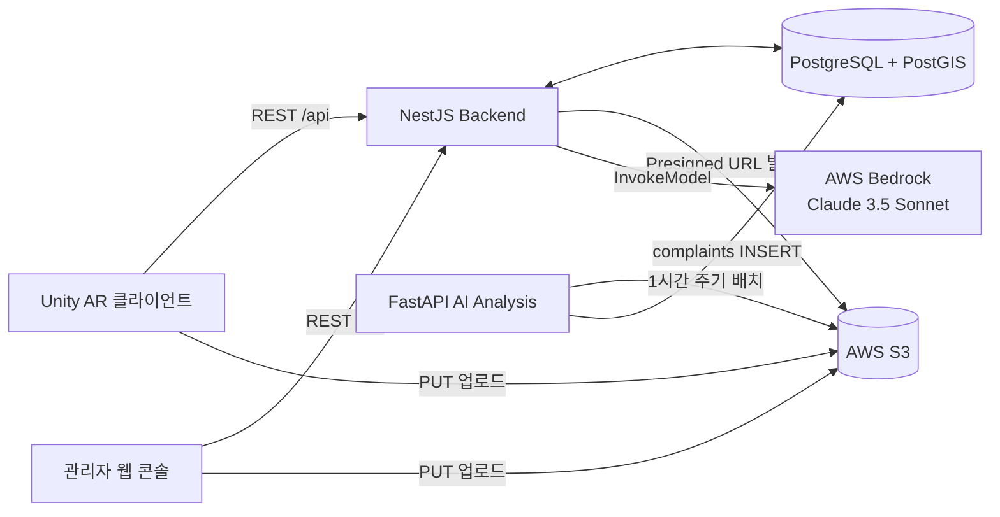

# Seoul Meari Backend

서울 메아리(Seoul Meari) 플랫폼의 API 서버입니다. Unity AR 클라이언트와 관리자 웹 콘솔이 공통으로 사용하는 REST API를 제공하며, PostgreSQL(PostGIS)과 AWS S3·Bedrock을 연동합니다.

| 구분 | 내용 |
|---|---|
| 프레임워크 | NestJS 11 (TypeScript 5, Express) |
| 데이터베이스 | PostgreSQL + PostGIS (`geography(PointZ, 4326)`), TypeORM 0.3 |
| 스토리지 | AWS S3 (Presigned URL 방식, 서버는 파일을 거치지 않음) |
| AI | AWS Bedrock (Anthropic Claude 3.5 Sonnet) — AI 도슨트 |
| 배포 | Docker / docker-compose, AWS EC2 + RDS(SSL) |

## 서울 메아리 프로젝트

서울 메아리는 서울 도심을 배경으로 하는 위치 기반 AR 플랫폼입니다. 이 저장소는 그중 백엔드를 담당하며, 나머지 구성 요소는 아래 저장소에 있습니다.

| 저장소 | 역할 |
|---|---|
| [Seoul_Meari_Client](https://github.com/Team-Little-Brother/Seoul_Meari_Client) | Unity 모바일 AR 앱 (AR 메아리, 타임 트래블, 온디바이스 YOLO, AI 도슨트) |
| **Seoul_Meari_Backend** (현재) | NestJS REST API, S3 Presigned URL, 번들 등록, 관리자 대시보드 집계 |
| [Seoul_Meari_AI_Analysis](https://github.com/Team-Little-Brother/Seoul_Meari_AI_Analysis) | FastAPI 배치 분석 서버 — S3 이미지를 Bedrock으로 진단해 민원(complaints) 생성 |
| [Seoul_Meari_manage_Client](https://github.com/Team-Little-Brother/Seoul_Meari_manage_Client) | React 관리자 콘솔 — 대시보드, AI 도시 진단, AR 메아리·VR 콘텐츠 관리 |



## 주요 기능

- **AR 메아리(Echo)**: 사용자가 남긴 위치 기반 메시지를 저장하고, 위·경도 격자 범위로 주변 메시지를 조회합니다. 이미지는 S3 Presigned URL로 업로드하고 저장 전에 `headObject`로 존재 여부를 검증합니다.
- **AI 도시 진단 민원(Complaints)**: AI 분석 서버가 생성한 민원을 조회하고 해결 처리합니다. 관리자 대시보드용 집계(주간 추이, 태그 분포, 시간대 분포)를 제공합니다.
- **AI 도슨트(Docent)**: 사진·GPS·질문을 받아 Bedrock Claude 3.5 Sonnet에 전달하고 안내 답변을 돌려줍니다. 업로드된 임시 파일은 응답 후 즉시 삭제합니다.
- **VR 에셋 번들 관리(Bundles)**: 관리자 콘솔이 Unity 에셋 번들을 S3에 직접 올린 뒤 레이아웃 JSON과 메타데이터로 등록합니다. 업로드 세션을 `pessimistic_write` 락과 트랜잭션으로 마무리해 중복 등록을 막습니다.
- **S3 Presigned URL 발급**: 용도별(분석 이미지, 메아리 이미지, 번들, 관리자 조회) 키 규칙과 만료 시간을 서버가 통제합니다.

## 프로젝트 구조

```
src/
├── main.ts                     # 부트스트랩, 글로벌 프리픽스 'api', CORS
├── app.module.ts               # 모듈 조립 + RouterModule
├── app.controller.ts           # GET /api/health
├── common/
│   ├── database/               # TypeORM 설정 (dev: synchronize, prod: RDS SSL)
│   └── types/location-data.type.ts
├── s3/                         # Presigned URL 발급 (aws-sdk v2)
│   └── dto/                    # analysis / echo / bundle 요청 DTO
├── seoulmeari/                 # 앱 클라이언트용 도메인
│   ├── echo/                   # AR 메아리 CRUD + 근접 조회 (PostGIS)
│   ├── complaints/             # AI 진단 민원 조회·해결
│   ├── docent/                 # AI 도슨트 (Bedrock)
│   └── auth/ media/ places/    # 스캐폴드만 존재 (미구현)
└── seoulmeari-manage/          # 관리자 콘솔용 도메인
    ├── bundles/                # 에셋 번들 등록·목록, 업로드 세션
    ├── dashboard/              # 통계 집계 API
    └── admin/ auth/            # 스캐폴드만 존재 (미구현)
```

## API

모든 엔드포인트는 `/api` 아래에 있습니다. (`RouterModule`의 `api`/`manage` 경로는 하위 모듈 컨트롤러에 적용되지 않아 실제 경로에는 나타나지 않습니다.)

### 공통

| Method | Path | 설명 |
|---|---|---|
| GET | `/api/health` | 서버 상태 확인. Unity 부트스트랩이 재시도하며 호출 |

### AR 메아리 (`/api/echo`)

| Method | Path | 설명 |
|---|---|---|
| GET | `/api/echo/nearby?lat&lon&z&degree` | `(lat, lon)`에서 `+degree` 만큼의 격자 범위 안 메시지 조회 (`ST_X/ST_Y`) |
| POST | `/api/echo` | 메시지 생성. `imageKey`가 있으면 S3 존재 여부 검증 |
| GET | `/api/echo/echo-list?page&limit&search` | 관리자용 페이지네이션 목록 + 오늘(KST) 생성 수 |
| GET | `/api/echo/echo-list/:id` | 단건 조회 |
| DELETE | `/api/echo/echo-list/:id` | 삭제 (연결된 S3 이미지도 삭제 시도) |

POST `/api/echo` 본문 예시:

```json
{
  "id": "client-generated-uuid",
  "writer": "Seoul Meari",
  "content": "경복궁 앞 은행나무가 노랗게 물들었어요",
  "imageKey": "echo_images/<uuid>-photo.jpg",
  "createdAt": "2025-09-26T09:12:00.000Z",
  "location": { "latitude": 37.5796, "longitude": 126.977, "z": 0 }
}
```

### AI 도시 진단 민원 (`/api/complaints`)

| Method | Path | 설명 |
|---|---|---|
| GET | `/api/complaints/complaints-list` | 전체 민원 목록 |
| GET | `/api/complaints/complaints-list/:id` | 단건 조회 |
| PATCH | `/api/complaints/complaints-list/:id/resolve` | `is_confirmed = true` 처리 |

### AI 도슨트 (`/api/docent`)

| Method | Path | 설명 |
|---|---|---|
| POST | `/api/docent/question` | `multipart/form-data`: `img_file`(≤5MB, jpeg/png/webp/gif), `gps_data`, `question` → `{ success, answer }` |

### S3 Presigned URL (`/api/s3`)

| Method | Path | 용도 | 생성 키 규칙 | 만료 |
|---|---|---|---|---|
| POST | `/api/s3/presigned-urls/analysis` | Unity YOLO 검출 이미지 일괄 업로드 | `upload_image/{YYYYMMDD}/{HHmmss}_{objectName}_{uuid8}{ext}` | 5분 |
| POST | `/api/s3/presigned-url/echo` | 메아리 이미지 업로드 | `echo_images/{uuid}-{filename}` | 5분 |
| GET | `/api/s3/presigned-url/echo/image?image-key=` | 메아리 이미지 조회 | — | 1시간 |
| POST | `/api/s3/presigned-urls/bundle` | 에셋 번들 업로드 (업로드 세션 생성) | `bundles/{uploadId}/{fileName}` | 5분 |
| POST | `/api/s3/presigned-url/manage` | 관리자 콘솔의 객체 조회 (`{ S3_url }`) | — | 1시간 |

`objectName`에는 Unity 온디바이스 YOLO의 검출 클래스(`sld` 단단한 쓰레기, `slp` 비정형 쓰레기)가 들어가며, AI 분석 서버가 이 키를 파싱해 태그로 사용합니다.

### VR 에셋 번들 (`/api/bundles`)

| Method | Path | 설명 |
|---|---|---|
| GET | `/api/bundles?q&usage&status&os&sortBy&sortOrder&page&limit` | 목록. `usage: historical/promo/both`, `status: draft/published/archived`, `os: android/ios`, `sortBy: recent/size/name` |
| POST | `/api/bundles/finalize-upload` | `multipart/form-data`: `layoutFile`(JSON) + `uploadId, name, version, usage, os, tags(콤마), description, latitude, longitude, altitude` |

번들 업로드 흐름:

1. `POST /api/s3/presigned-urls/bundle` → `upload_sessions` 행 생성(`PENDING → UPLOADING`), 파일별 Presigned URL 반환
2. 클라이언트가 S3에 직접 `PUT`
3. `POST /api/bundles/finalize-upload` → 세션 락 → 레이아웃 JSON 검증 → `bundles` 행 생성(`DRAFT`) → 세션 `COMPLETED`

레이아웃 JSON 형식(`LayoutJson`)은 [`src/seoulmeari-manage/bundles/type.ts`](src/seoulmeari-manage/bundles/type.ts)에 정의되어 있으며 `prefabs`, `placementGroups`(프리팹별 위·경도·고도·회전·스케일 배치), `totalSizeMB` 등을 포함합니다.

### 관리자 대시보드 (`/api/dashboard`)

| Method | Path | 설명 |
|---|---|---|
| GET | `/api/dashboard/summary` | 최근 7일 진단 수·해결률(이전 7일 대비 변화율), 전체 메아리 수 |
| GET | `/api/dashboard/ai-summary` | 전체/해결/미처리 건수와 최근 24시간 증가분 |
| GET | `/api/dashboard/weekly-diagnoses` | 최근 7일 일자별 `total / resolved` |
| GET | `/api/dashboard/tag-distribution` | 태그별 민원 수 |
| GET | `/api/dashboard/hourly-complaint-distribution` | 0~23시 시간대별 민원 수 |

## 데이터 모델

| 테이블 | 주요 컬럼 | 비고 |
|---|---|---|
| `echo` | `id`(클라이언트 생성), `writer`, `content`, `image_key`, `created_at`, `location geography(PointZ)` | 공간 인덱스 |
| `complaints` | `complaint_id`, `latitude/longitude/altitude`, `tag`, `timestamp`, `S3_url`, `danger`, `solution`, `detail`, `is_confirmed` | AI 분석 서버가 INSERT, 백엔드는 조회·해결 |
| `bundles` | `name`, `version`, `usage`, `os`, `asset_status`, `tags[]`, `layout_json(jsonb)`, `prefabs[]`, `location geography(PointZ)` | `(name, version)` 유니크, `upload_session_id` 1:1 |
| `upload_sessions` | `status(pending/uploading/completed)`, `s3_prefix`, `files(jsonb)`, `expires_at`, `completed_at` | 번들 업로드 세션 |

개발 환경에서는 `synchronize: true`로 스키마를 자동 생성합니다. 운영 DB에는 PostGIS 확장이 설치되어 있어야 합니다.

## 실행 방법

### 환경 변수 (`.env`)

```env
PORT=3000
NODE_ENV=development          # production이면 RDS SSL CA(/home/ec-user/certs/global-bundle.pem) 사용

DB_HOST=localhost
DB_PORT=5432
DB_USERNAME=postgres
DB_PASSWORD=postgres
DB_DATABASE=seoul_meari

AWS_REGION=us-west-1          # S3 리전
S3_BUCKET_NAME=your-bucket
AWS_BEDROCK_REGION=us-east-1  # 도슨트용 Bedrock 리전
```

AWS 자격 증명은 코드에 넣지 않고 IAM Role 또는 표준 자격 증명 체인(`~/.aws`, 환경 변수)을 사용합니다.

### 로컬

```bash
npm install
npm run start:dev      # http://localhost:3000/api/health
npm run test           # jest 단위 테스트
npm run lint
```

### Docker

```bash
docker compose up --build
```

`docker-compose.yml`은 소스를 볼륨 마운트하고 `npm run start:dev`로 실행하므로 코드 변경이 즉시 반영됩니다. DB는 포함되어 있지 않으므로 별도의 PostgreSQL(PostGIS)을 준비하고 `.env`로 연결합니다.

## CORS

`localhost:5173`(관리자 콘솔 개발 서버)과 Amplify 배포 도메인만 허용합니다. 새 프론트엔드 도메인을 추가할 때는 [`src/main.ts`](src/main.ts)의 `origin` 목록을 수정합니다.

## 알려진 상태 / TODO

- `auth`, `media`, `places`, `admin` 모듈은 NestJS 스캐폴드만 있고 로직이 없습니다. 인증·인가는 아직 적용되지 않았습니다.
- Unity 타임 트래블 씬이 호출하는 `/api/unity/bundle/...` 컨트롤러(`unity.controller.ts`)는 주석 처리되어 있습니다.
- `class-validator` 데코레이터는 있으나 글로벌 `ValidationPipe`가 없어 `echo-list`를 제외한 엔드포인트는 DTO 검증이 실행되지 않습니다.
- S3는 `aws-sdk` v2를, Bedrock은 `@aws-sdk` v3를 사용합니다.
